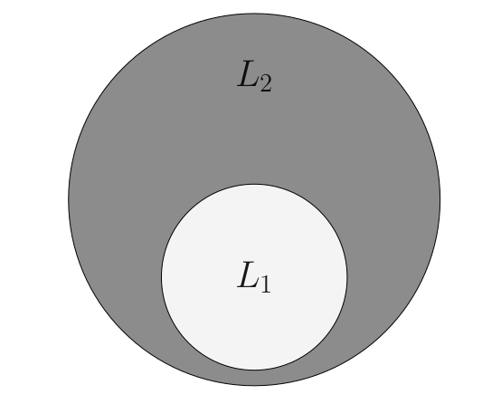

# Master Thesis

The language inclusion problem is a fundamental and classical problem which consists in deciding, given two languages, whether one is a subset of the other or not.  This problem has a wide variety of applications, ranging from automata-based verification and reasoning for logical theories to type systems.  Whether the language inclusion problem is computable or not, depends on the nature of the languages and, also if it turns out to be computable, it is usually computationally intensive.  Our work is based on a framework that takes advantage of Abstract Interpretation techniques in order to solve the language inclusion problem between omega-regular languages.  The framework is parametrized by a pair of preorders on words, and our ultimate goal is to put forward a number of quasiorders on words that are based on the simulation relation on the states of an automaton.  We explore an ample mix of simulation relations, from the well-known direct simulation, up to less celebrated simulations, as the k-lookahead simulation.
